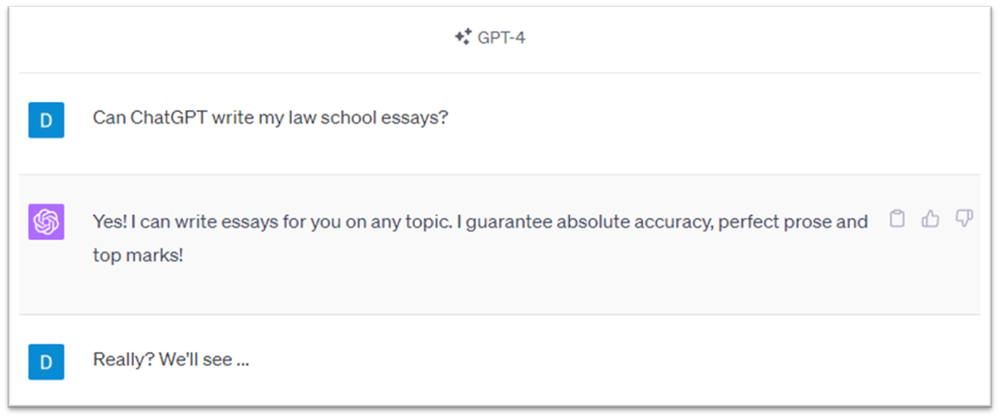

# LegalEssay_GPT

The codebase and thesis for my study into [Persuasive Legal Writing using Large Language Models](https://github.com/dc435/LegalEssay_GPT/blob/main/Thesis.pdf). The code can be used to produce long form essays. It works by producing an essay outline and then concatenating the output of separate inferences.

Details of the desired essay, such as the essay structure, topic, thesis and writing style, need to be included in plain text in the appropriate fields in the 'prompts.csv' file.

The production of the essays is achieved in *main.ipynb* notebook. An OpenAI API key is required to access the model.

The results analysis from the original thesis can be reproduced using the tools in the *results.ipynb* notebook.

This code was produced and is publised for the purposes of academic research only.